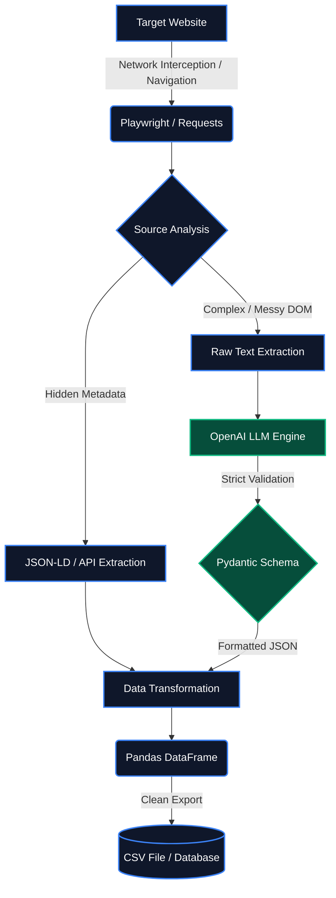

# 🕸️ Advanced Web Scraping & AI Data Extraction Framework

[](https://www.python.org/)
[](https://playwright.dev/)
[](https://openai.com/)
[](https://pandas.pydata.org/)

## 📖 System Overview

This repository contains a **production-ready Web Scraping and ETL (Extract, Transform, Load) framework**. It is designed to bypass enterprise-grade anti-bot protections, handle dynamic JavaScript rendering, and utilize Large Language Models (LLMs) to extract structured data from complex, unstructured DOMs.

The framework is modular, allowing for simple static HTML parsing or deploying advanced asynchronous browser agents depending on the target architecture's security level.

## 🚀 Core Capabilities

* **Advanced Anti-Bot Evasion:** Bypasses WAFs (Cloudflare Turnstile, DataDome) using `playwright-stealth`, custom behavioral emulation, and IP reputation management.
* **LLM-Powered DOM Parsing:** Integrates AI (OpenAI API) and `Pydantic` to parse chaotic web elements into strict JSON schemas, eliminating reliance on brittle CSS selectors.
* **API Interception & Hidden Metadata:** Analyzes network traffic to extract underlying JSON-LD or intercept native APIs, drastically reducing server load and execution time.
* **Data Pipeline Integration:** Includes automated cleaning, type coercion, and structuring of raw data into production-ready Pandas DataFrames and CSVs.

---

## 🕵️‍♂️ Real-World Case Studies & Implementations

To demonstrate the framework's capability against modern web security, the `/advanced_scraper_project` directory includes specific implementations tailored to highly guarded architectures:

### 1. Defeating WAFs: The Indeed Architecture (`/indeed_scraper`)
* **The Challenge:** Bypassing Cloudflare Turnstile and DataDome, which heavily monitor automated behavior and IP reputation. Standard stealth drivers (`undetected-chromedriver`) failed.
* **The Solution:** * **Behavioral Emulation:** Engineered a system using `numpy` and `scipy` to generate mathematical **Bézier curves**, simulating erratic, human-like mouse movements via `ActionChains` to defeat behavioral analysis.
    * **Network Stealth:** Implemented mobile proxy tethering (4G/5G) to leverage high-reputation CGNAT IP addresses.
    * **Dynamic DOM:** Utilized Playwright MCP workflows to dynamically locate updated CSS containers (e.g., `#mosaic-provider-jobcards`).
* **Result:** Successfully bypassed edge protections and reliably extracted job data into a structured CSV.

### 2. Native API Interception: The Reddit Architecture (`/reddit_scraper`)
* **The Challenge:** Scraping massive amounts of data from a React-heavy frontend behind login walls that actively blocks headless browsers.
* **The Solution:** Bypassed the frontend entirely. Discovered and intercepted Reddit's native JSON endpoints, using simple, well-formatted HTTP `requests` to extract tens of thousands of records (`post_title`, `upvotes`, `comments`) instantly and without blocks.

### 3. Hidden Metadata Parsing: The Craigslist Architecture (`/craig_list_example`)
* **The Challenge:** Extracting granular, unstructured technical specifications efficiently from a list view.
* **The Solution:** Abandoned standard DOM parsing. The script locates and parses embedded `application/ld+json` tags directly from the source code, extracting perfectly structured product data natively.

---

## 🏗️ Architecture & Usage

### Arquitecture scheme


### The Fundamentals (`/Root`)
Contains standalone modules for basic data extraction and processing:
* `1-Basic_Scraping.py` / `2-Dynamic_Sites_Scraping_Selenium.py`: Base HTTP requests and DOM manipulation.
* `4-Playwrigth_MCP_workflow.md`: Agentic workflow configurations.
* `5-Data_Proccesing.ipynb`: Jupyter Notebook for cleaning and structuring scraped data via `pandas`.

### The Core Engine (`/playwright_project` & `/advanced_scraper_project`)
The main execution environment for asynchronous extraction:
* `web_scraper_project.py`: The robust Playwright asynchronous engine.
* `advanced_scraper.py`: The stealth-oriented framework integrating proxy rotation and AI parsing.
* `data_cleaner.py`: The data transformation utility for JSON to CSV conversion.

---

## ⚙️ Quick Start

1.  **Clone the repository:**
    ```bash
    git clone [https://github.com/marcos-caballero/Web-Scraping_vibe_coding.git](https://github.com/marcos-caballero/Web-Scraping_vibe_coding.git)
    cd Web-Scraping_vibe_coding
    ```

2.  **Install Dependencies:**
    ```bash
    pip install -r advanced_scraper_project/requirements.txt
    playwright install chromium
    ```

3.  **Environment Configuration:**
    To enable advanced anti-bot evasion and AI parsing, copy `.env.example` to `.env` inside `advanced_scraper_project` and add your rotating proxy URI and API keys.

---
*Built by [Marcos Caballero](https://github.com/marcos-caballeronieto) - Full-Stack AI Developer & Data Engineer.*
